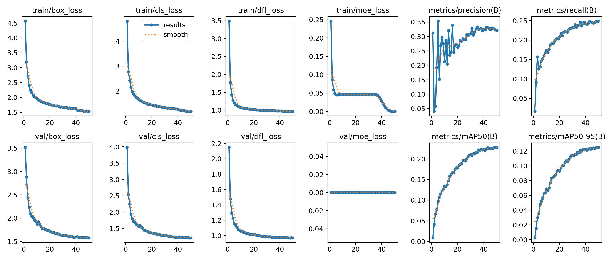
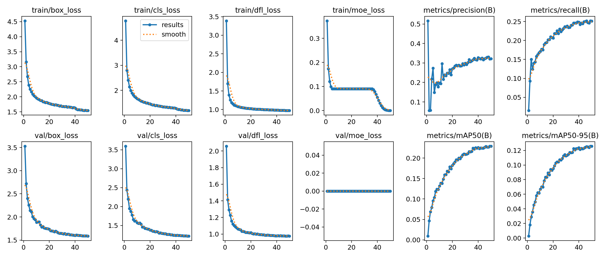

# Issue 53 VisDrone 训练报告

运行日期：2026-07-02

远端环境：RTX 3090 cluster node

GPU：NVIDIA GeForce RTX 3090 24GB

数据集：`$YOLO_ISSUE53_ROOT/datasets/VisDrone/visdrone.yaml`

训练输出目录：`$YOLO_ISSUE53_ROOT/runs/issue53_visdrone_3090_noamp`

完整日志：`$YOLO_ISSUE53_ROOT/logs/issue53_train_v10_then_moa_3090_noamp.log`

启动命令：

```bash
export YOLO_ISSUE53_ROOT=/path/to/experiment-root
cd "$YOLO_ISSUE53_ROOT/YOLO-Master"
BATCH=30 WORKERS=8 PROJECT_OUT="$YOLO_ISSUE53_ROOT/runs/issue53_visdrone_3090_noamp" \
  bash scripts/issue53/launch_train_3090_noamp.sh
```

共同设置：

- `epochs=50`
- `batch=30`
- `imgsz=640`
- `workers=8`
- `cache=ram`
- `amp=False`
- `device=0`

baseline 和 MoA 都使用 no-AMP。原因是旧 AMP 训练排查中，NaN 首先出现在上游
`VisualEnhancedAdaptiveGateMoE`，而不是 MoA 模块本身；同一 MoA checkpoint/state
在 no-AMP 下可以稳定完成训练。

## 结果

| Model | Epoch | Precision | Recall | mAP50 | mAP50-95 |
| --- | ---: | ---: | ---: | ---: | ---: |
| YOLO-Master v0.10 baseline | 50 | 0.32125 | 0.24908 | 0.22706 | 0.12492 |
| YOLO-Master v0.10 MoA | 50 | 0.32205 | 0.25108 | 0.22893 | 0.12574 |

按 mAP50-95 选择的 best checkpoint：

| Model | Best Epoch | Precision | Recall | mAP50 | mAP50-95 |
| --- | ---: | ---: | ---: | ---: | ---: |
| YOLO-Master v0.10 baseline | 49 | 0.32251 | 0.24875 | 0.22778 | 0.12501 |
| YOLO-Master v0.10 MoA | 50 | 0.32205 | 0.25108 | 0.22893 | 0.12574 |

MoA 完整完成 50 epoch，并跨过旧 AMP run 中 epoch 14 附近的 NaN 失败点。
训练日志中以下异常关键字匹配数为 0：

```text
TaskAlignedAssigner|OutOfMemory|Traceback|RuntimeError|nan|NaN|non-finite
```

## Loss 与指标曲线

Baseline:



MoA:



## 权重

- Baseline: `$YOLO_ISSUE53_ROOT/runs/issue53_visdrone_3090_noamp/v10/weights/best.pt`
- MoA: `$YOLO_ISSUE53_ROOT/runs/issue53_visdrone_3090_noamp/v10_moa/weights/best.pt`
